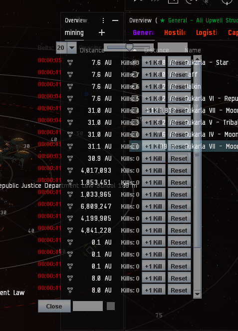

# Eve Rat Timer Tracker

A lightweight, always-on-top overlay for tracking multiple ratting belt timers in EVE Online. Replace manual log parsing with simple, per-belt stopwatches you reset with a button. The transparent GUI is fully draggable and resizable.

## Features

- **Multiple Belt Timers**: Configurable number of belt panels (1–20).
- **Per-Belt Stopwatches**: Each panel shows an elapsed-time clock and a **Reset** button.
- **Per-Belt Kill Counter**: Track kills manually with a counter button. Saved in config.
- **Transparent Overlay**: Adjustable opacity via a slider.
- **Drag & Move**: Click-and-drag handles on top and bottom to reposition.
- **Resizable**: Bottom-right resize grip to adjust window size.
- **Persistent Config**: Saves window position, size, opacity, belt count, and kills in `config.properties`.
- **Color-Coded Timers**:
  - 🟢 Green (0–15 min)
  - 🟡 Yellow (15–20 min)
  - 🔴 Red (20–25+ min)

## Screenshot



## Getting Started

### Prerequisites
- Java 11 or higher installed.
- (Optional) Eclipse or other Java IDE for building from source.

### Building

1. Clone the repository:
   ```bash
   git clone https://github.com/tndmadman/evebelttimer.git
   cd evebelttimer
   ```

2. Build a runnable JAR using Gradle or Eclipse:

   **With Gradle** (if you add `build.gradle`):
   ```bash
   ./gradlew clean shadowJar
   ```
   The JAR will be in `build/libs/evebelttimer-all.jar`.

   **With Eclipse**:
   - Import the project as a Java project.
   - Right-click the project → **Export** → **Runnable JAR file**.
   - Choose `com.evetimer.App` as the main class and bundle required libraries.

3. (Optional) Wrap the JAR into a Windows executable with [Launch4j](https://launch4j.sourceforge.net/).

### Running

Double-click the generated JAR (or EXE) to launch. If Java isn’t associated with JAR files, run from command line:
```bash
java -jar evebelttimer.jar
```

## Usage

1. **Set Belt Count**: Choose how many timers you need (1–20).
2. **Adjust Opacity**: Use the slider to change transparency.
3. **Start Timers**: Each belt panel starts counting automatically.
4. **Reset a Timer**: Click its **Reset** button after a belt clear.
5. **Track Kills**: Click the kill + button to increment the kill counter.
6. **Move the Window**: Drag by the top or bottom drag handles.
7. **Resize Window**: Use the bottom-right grip.
8. **Close Application**: Click **Close**.

## Configuration

Stored in `config.properties` alongside the JAR:
```properties
x=100
y=100
width=400
height=200
beltCount=5
opacity=0.85
kills0=3
kills1=1
...
```

Modify or delete this file to reset settings.

## Version

**v1.1a**  
**SHA256 for EvETimer1.1a.jar**:  
`1759d410f30168c5de6567ccb14bce6561edccc077606288e11dc687d5f7981a`

## Minor Changes

- Belt UI panels now resize with window scaling.
- GUI updates fixed to prevent ghosting/visual glitches.
- Config save triggers after every relevant UI interaction.
- Removed unused components and cleaned up layout structure.
- JAR now launches with no visible errors.

## Contributing

1. Fork the repo.
2. Create a feature branch.
3. Submit a pull request.

## License

MIT © tndmadman